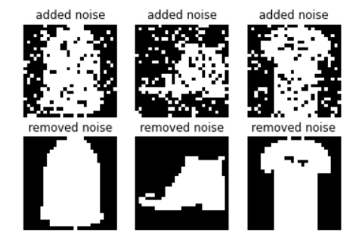

# HOPFIELD Noise Removing
This repository aims to solve noise removing with leveraging hopfield model. Firstly, we add some random noise to fashion mnist dataset. Then by updating synchronously we'll retreive the main image from it. And we know as Hopfield capability it can extract main image well. The fantastic feature of Hopfield is that without even seeing an image before, it can remove noise from that image.

    

 